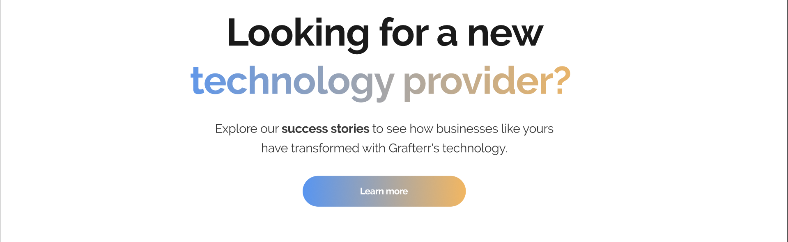
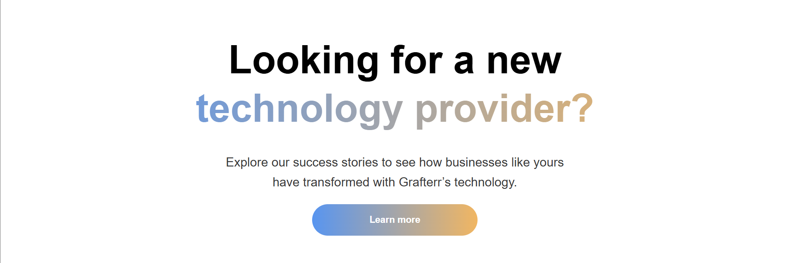
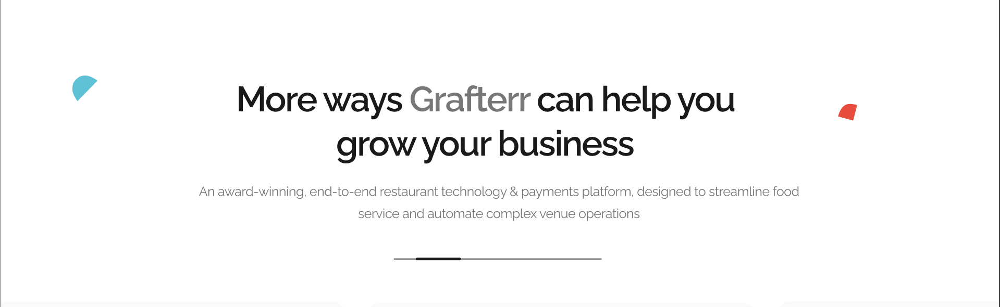
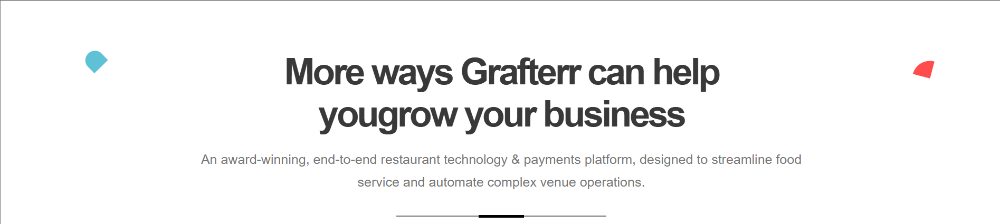
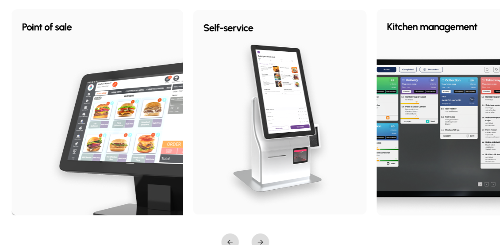
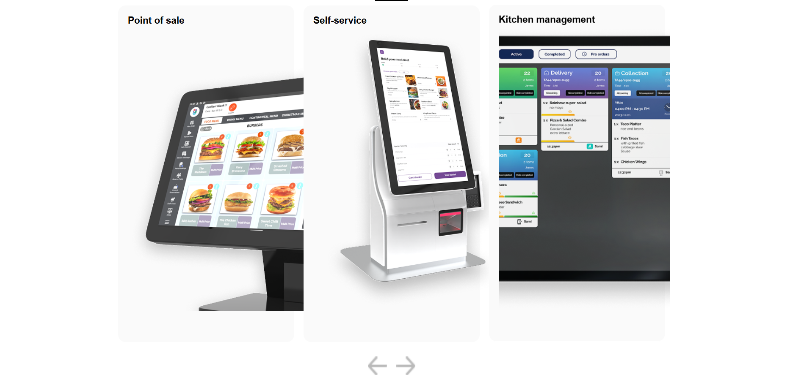

# 📦 Dynamic Content-Driven UI (React)

This project demonstrates a **content-driven React UI** where all major sections of the application are powered by a structured JSON file instead of hardcoded data.

---

## 🛠 Tech Stack

* React.js
* JavaScript (ES6+)
* CSS (Responsive Design)

---

## 🚀 Features

* ✅ Initially implemented UI with **hardcoded data**
* ✅ Refactored to use **dynamic JSON-based content**
* ✅ Built a **custom React hook (`useContent`)** for data fetching
* ✅ Implemented **error handling & loading state**
* ✅ Added **skeleton UI** for better user experience
* ✅ Developed **carousel logic** with responsiveness
* ✅ Fully **responsive design** (mobile, tablet, desktop)

---

## 📁 Content JSON Structure

Create a file at:

```
/public/data/content.json
```

### 🔧 Structure

```json
{
  "navigation": {
    "logo": {
      "src": "",
      "alt": ""
    },
    "links": [
      {
        "label": "",
        "url": ""
      },
      {
        "label": "",
        "url": ""
      }
    ],
    "cta": {
      "label": "",
      "url": ""
    }
  },
  "hero": {
    "headlinePrefix": "Looking for a new",
    "headlineGradient": "technology provider?",
    "subheadline": "Explore our success stories to see how businesses like yours have transformed with Grafterr’s technology.",
    "cta": {
      "label": "Learn more",
      "url": "#learn-more"
    },
    "decorativeShapes": [
      {
        "type": "shape",
        "position": "left",
        "color": "blue"
      },
      {
        "type": "shape",
        "position": "right",
        "color": "red"
      }
    ]
  },
  "featuresSection": {
    "title": "More ways Grafterr can help you",
    "titleAccent": "grow your business",
    "subtitle": "An award-winning, end-to-end restaurant technology & payments platform, designed to streamline food service and automate complex venue operations.",
    "products": [
      {
        "title": "Point of sale",
        "image": ""
      },
      {
        "title": "Self-service",
        "image": ""
      },
      {
        "title": "Kitchen management",
        "image": ""
      }
    ]
  },
  "carousel": {
    "itemsPerView": {
      "mobile": 1,
      "tablet": 2,
      "desktop": 3
    },
    "showArrows": true
  }
}
```

---

## 🧠 Custom Hook

A reusable hook (`useContent`) is used to:

* Fetch JSON data
* Handle loading state
* Handle errors

---

## 📱 Responsive Design

* Mobile-first approach
* Adaptive carousel behavior:

  * 📱 Mobile → 1 item
  * 📱 Tablet → 2 items
  * 💻 Desktop → 3 items

---

## 🎯 Key Learnings

* Separation of **data and UI**
* Building **scalable components**
* Managing **async data fetching in React**
* Implementing **custom hooks**
* Creating **responsive layouts**
* Writing **clean and reusable logic**
* Managing **production vs development** differences

---

## ▶️ Getting Started

```bash
npm install
npm run dev
```

---

## 📷 Preview

> UI dynamically renders based on JSON configuration.

---


## ⚙️ Deployment Details

* Platform: Vercel
* Build Command: npm run build
* Output Directory: dist
* CI/CD: Automatic deployment via GitHub

---

## Screenshot Comparison
| Section        | Figma                                | Application   |
|:---------------|:-------------------------------------|:-------------:|
| Hero Section   |              |   |
| Feture Section |              |  |
| Carousel       |              |   |


---

## 🌐 Deployment

Deployed using Vercel

🔗 Live Demo

👉 https://grafterr-landing-liard.vercel.app/

---